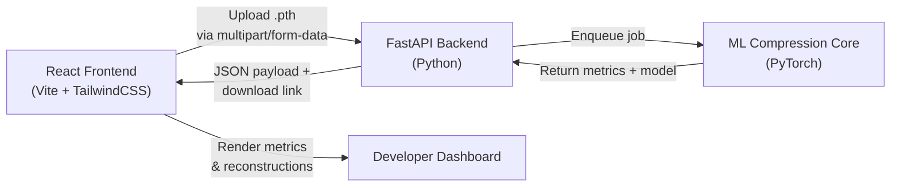
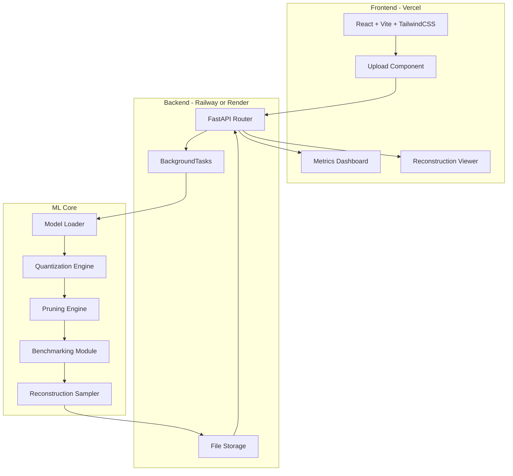
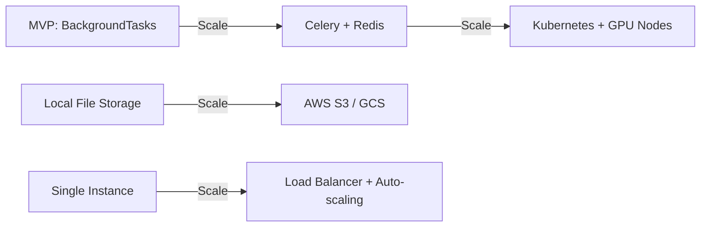

# Automated AI Model Compression Pipeline — Architecture & Design

## 1. System Overview

A B2B SaaS platform that lets developers upload heavy PyTorch models, automatically applies compression (quantization + pruning), and returns an optimized, edge-ready model with full performance metrics.



---

## 2. End-to-End Data Flow

### Step 1 — Model Upload (Frontend → Backend)

1. Developer drags a `.pth` file onto the upload zone in the React UI.
2. The file is sent as `multipart/form-data` to `POST /api/v1/upload`.
3. FastAPI validates the file extension and size (max 500 MB for MVP).
4. The file is persisted to a local `uploads/` directory and a unique `job_id` (UUID) is returned.

### Step 2 — Trigger Compression (Backend → ML Core)

1. Frontend calls `POST /api/v1/compress/{job_id}` with compression config:
   ```json
   {
     "quantization": true,
     "quantization_backend": "fbgemm",
     "pruning": true,
     "pruning_amount": 0.3,
     "model_type": "cnn_autoencoder"
   }
   ```
2. FastAPI dispatches the job to a **background task** (`BackgroundTasks`).
3. The ML core:
   - Loads the original `.pth` state dict into the target architecture.
   - Measures **original size** (bytes) and **original inference latency** (ms).
   - Applies **post-training static quantization** (FP32 → INT8).
   - Applies **unstructured L1 pruning** on Conv2d layers.
   - Measures **compressed size** and **compressed latency**.
   - Runs EMNIST test samples through both models to produce **reconstruction tensors** for visual fidelity comparison.
   - Saves the compressed model to `outputs/{job_id}/`.

### Step 3 — Return Results (Backend → Frontend)

1. Frontend polls `GET /api/v1/status/{job_id}` until status is `completed`.
2. The response payload:
   ```json
   {
     "job_id": "abc-123",
     "status": "completed",
     "original_size_mb": 12.4,
     "compressed_size_mb": 3.1,
     "compression_ratio": "4.0x",
     "original_latency_ms": 45.2,
     "compressed_latency_ms": 12.8,
     "speedup": "3.5x",
     "original_reconstructions": ["base64_encoded_image_1", "..."],
     "compressed_reconstructions": ["base64_encoded_image_2", "..."],
     "download_url": "/api/v1/download/abc-123"
   }
   ```
3. Frontend renders a side-by-side comparison dashboard with charts and image grids.

### Step 4 — Download Optimized Model

Developer clicks "Download" → `GET /api/v1/download/{job_id}` serves the compressed `.pth` as a binary stream.

---

## 3. Component Architecture



---

## 4. ML Pipeline Detail

### 4.1 Supported Model Architecture (PoC)

| Component | Detail |
|-----------|--------|
| **Architecture** | CNN Autoencoder (Encoder → Bottleneck → Decoder) |
| **Dataset** | EMNIST (28×28 grayscale) |
| **Task** | Image Reconstruction |
| **Input/Output** | Single-channel 28×28 images |

### 4.2 Compression Techniques

| Technique | Method | Target |
|-----------|--------|--------|
| **Quantization** | Post-Training Static (FP32 → INT8) | All linear + conv layers |
| **Pruning** | Unstructured L1 | Conv2d weight tensors, 30% sparsity |

### 4.3 Metrics Collected

| Metric | How |
|--------|-----|
| Model size (MB) | `os.path.getsize()` on saved state dict |
| Inference latency (ms) | Average of 100 forward passes, `time.perf_counter()` |
| Compression ratio | `original_size / compressed_size` |
| Speedup | `original_latency / compressed_latency` |
| Reconstruction fidelity | Side-by-side EMNIST sample outputs (returned as base64 images) |

---

## 5. API Contract

| Method | Endpoint | Description |
|--------|----------|-------------|
| `POST` | `/api/v1/upload` | Upload `.pth` model file |
| `POST` | `/api/v1/compress/{job_id}` | Start compression pipeline |
| `GET`  | `/api/v1/status/{job_id}` | Poll job status + get results |
| `GET`  | `/api/v1/download/{job_id}` | Download compressed model |
| `GET`  | `/api/v1/health` | Health check |

---

## 6. Deployment Strategy

### Frontend → Vercel
- **Why**: Zero-config for Vite/React, global CDN, free tier.
- **Build**: `npm run build` → static assets.
- **Env**: `VITE_API_URL` points to backend URL.

### Backend → Railway or Render

| Consideration | Railway | Render |
|---------------|---------|--------|
| **Free tier** | $5 credit/month | 750 free hours |
| **GPU support** | No (CPU only on free) | No (CPU only on free) |
| **Docker support** | Yes | Yes |
| **Auto-deploy** | Yes (GitHub) | Yes (GitHub) |
| **Best for MVP** | Fast iteration | Stable, predictable |

### Key Deployment Practices

1. **Containerize the backend** with Docker — pin Python 3.11, install `torch` CPU-only to keep image small.
2. **Use CPU-only PyTorch** for MVP: `torch+cpu` saves ~1.5 GB in image size.
3. **Set file size limits** at the reverse proxy level (max 500 MB).
4. **Background task processing** via FastAPI's `BackgroundTasks` (no Celery needed for MVP).
5. **CORS**: Allow the Vercel frontend domain explicitly.
6. **Health checks**: `/api/v1/health` for uptime monitoring.

### Scaling Path (Post-MVP)



---

## 7. Project Structure

```
automated-ai-model-compression/
├── backend/
│   ├── app/
│   │   ├── __init__.py
│   │   ├── main.py              # FastAPI app entry
│   │   ├── routers/
│   │   │   ├── __init__.py
│   │   │   └── compression.py   # API endpoints
│   │   ├── core/
│   │   │   ├── __init__.py
│   │   │   ├── compressor.py    # ML compression pipeline
│   │   │   ├── models.py        # PyTorch model architectures
│   │   │   └── benchmarks.py    # Latency & size measurement
│   │   ├── schemas/
│   │   │   ├── __init__.py
│   │   │   └── responses.py     # Pydantic response models
│   │   └── utils/
│   │       ├── __init__.py
│   │       └── file_handler.py  # File upload/download helpers
│   ├── uploads/                 # Uploaded model storage
│   ├── outputs/                 # Compressed model storage
│   ├── requirements.txt
│   ├── Dockerfile
│   └── .env.example
├── frontend/                    # Vite + React + TailwindCSS
│   ├── src/
│   │   ├── components/
│   │   ├── pages/
│   │   ├── services/
│   │   ├── App.jsx
│   │   └── main.jsx
│   ├── package.json
│   └── vite.config.js
├── demo/
│   ├── train_autoencoder.py     # Train PoC EMNIST autoencoder
│   └── sample_models/           # Pre-trained .pth files
└── ARCHITECTURE.md
```
